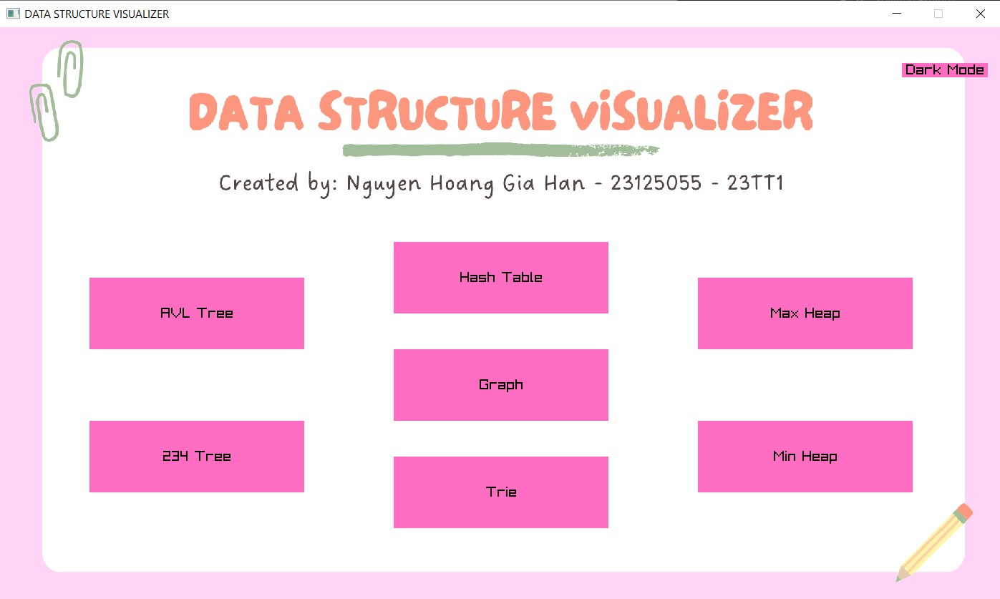
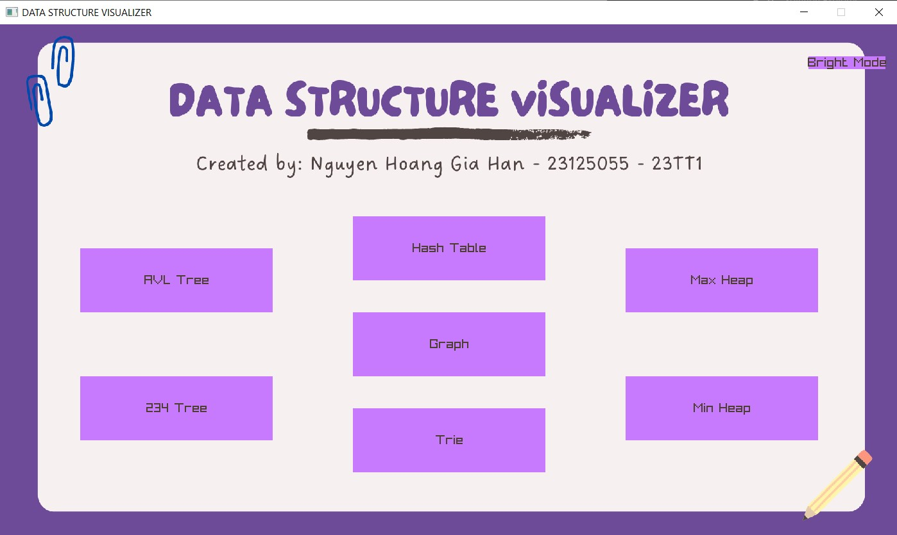
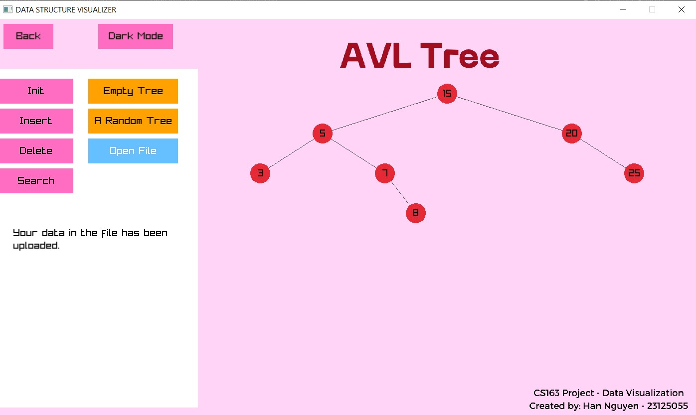
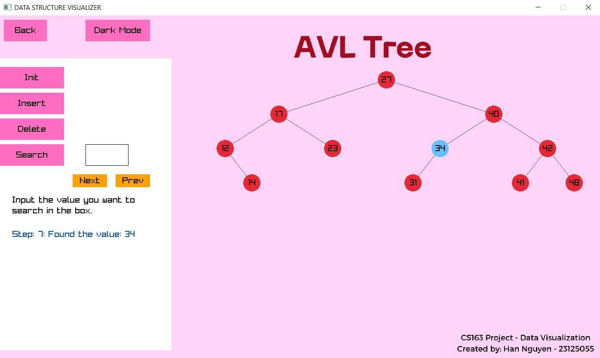
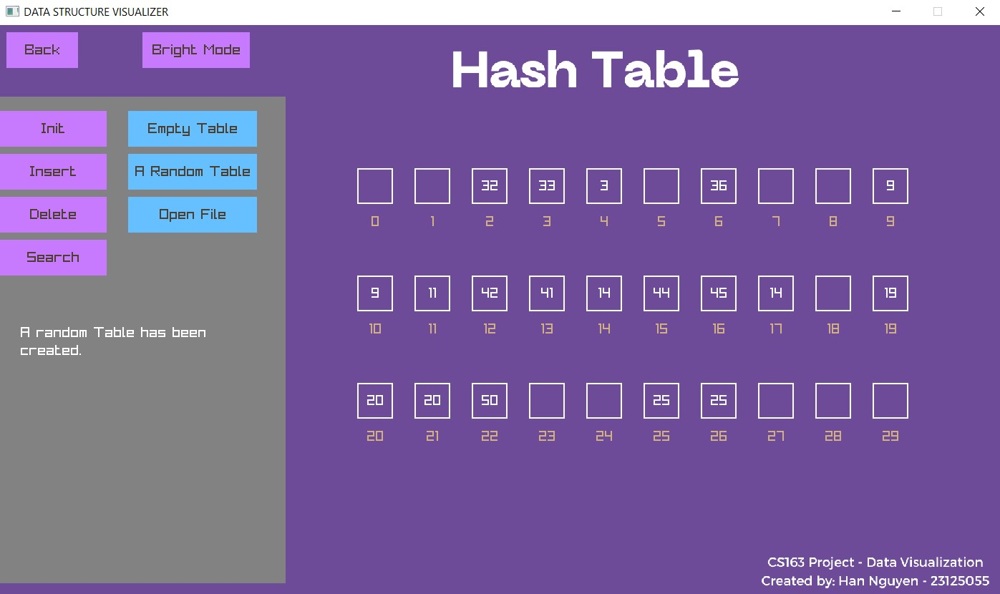

# APCS-CS163-Data-Structure
A comprehensive visualization tool for **various data structures**, including **Hash Table, AVL Tree, 2-3-4 Tree, Trie, Min Heap, Max Heap, and Graph**. This project aims to provide a clear, interactive, and step-by-step visualization of these data structures to enhance understanding and facilitate learning.

This application is developed as a part of the CS163 course at FIT, VNU-HCMUS.
## Features
**1. Hash Table:**
- Initialize from a file or with randomized data.
- Support for insert, delete, and search operations, each with step-by-step visualization.

**2. AVL Tree:**
- Initialize from a file or with randomized data.
- Support for insert, delete, and search operations with step-by-step animations, including tree rotations.

**3. 2-3-4 Tree:**
- Initialize from a file or with randomized data.
- Visualize insertions and deletions, displaying how nodes split and merge with detailed step-by-step visualization.

**4. Trie:**
- Initialize from a file or with randomized data.
- Support for search operations with step-by-step visualization; insert with highlighted new node; run at once for delete operation.

**5. Graph:**
- Initialize from a file or using a matrix with randomized data.
- Visualize connected components, and find minimum spanning trees.

**6. Max Heap, Min Heap:**
- Initialize from a file or with randomized data.
- Support for insert and delete operations.
- Additional operations to get the top element and to get the size of the heap.

### Menu screen
Toggle between **light** and **dark themes** for comfortable viewing.
 
 

 ### Interactive Step-by-Step Mode and Controls
 - Visualize each operation step-by-step, with the ability to move forward and backward through the steps.
 - Nodes are highlighted during operations to indicate current actions, such as traversal, insertion, or deletion.
 - Use buttons to control the visualization flow, including 'Next' and 'Prev' for stepping through operations.
  

The AVL screen when searching node with value 34:

The Hash Table screen in dark mode:


## Getting Started
### Requirement
- **C++ Compiler:** Make sure you have a C++ compiler installed.
- **Raylib:** This project uses the Raylib graphics library. Install Raylib before building the project.
- **Other external library:** tinyfiledialogs.

### Installation
1. **Clone the repository:**
   ```bash
   git clone https://github.com/hannguyen2880/cpp-visualizer.git
   cd cpp-visualizer
   ```
2. **Build the project:**
   Compile the source code using your preferred C++ compiler. Ensure you link the essential libraries during the compilation process.

### Code Overview
- **`main.cpp`**: The entry point of the application, setting up the interface and initializing visualizations.
- **`AVLTree.cpp` / `AVLTree.h`**: Implements the AVL tree structure and its visualization logic, including rotations and height updates.
- **`Tree234.cpp` / `Tree234.h`**: Implements the 2-3-4 tree, handling node splits and merges with visualization.
- **`Trie.cpp` / `Trie.h`**: Implements the Trie structure with visualization for insert and search operations.
- **`HashTable.cpp` / `HashTable.h`**: Implements the Hash Table structure with visualization for insert, delete, and search operations.
- **`Heap.cpp` / `Heap.h`**: Implements the Min Heap and Max Heap structures with visualization for common heap operations.
- **`Graph.cpp` / `Graph.h`**: Implements the Graph structure with visualization for graph traversal and minimum spanning tree algorithms.
- **`screen.cpp` / `screen.h`**: Manages the graphical user interface and interaction logic.

## License
This project is licensed under the MIT License. See the [LICENSE](LICENSE) file for more details.
